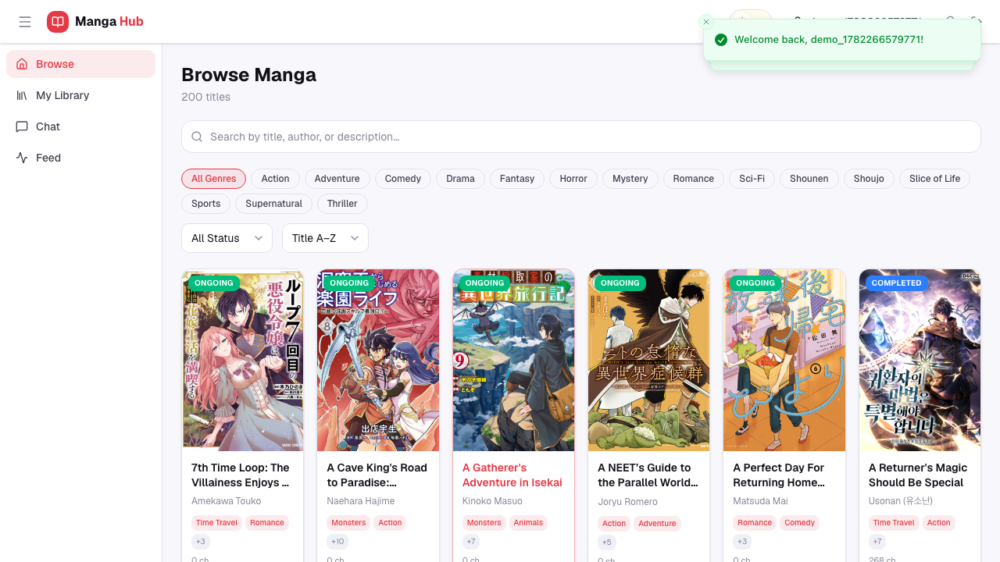
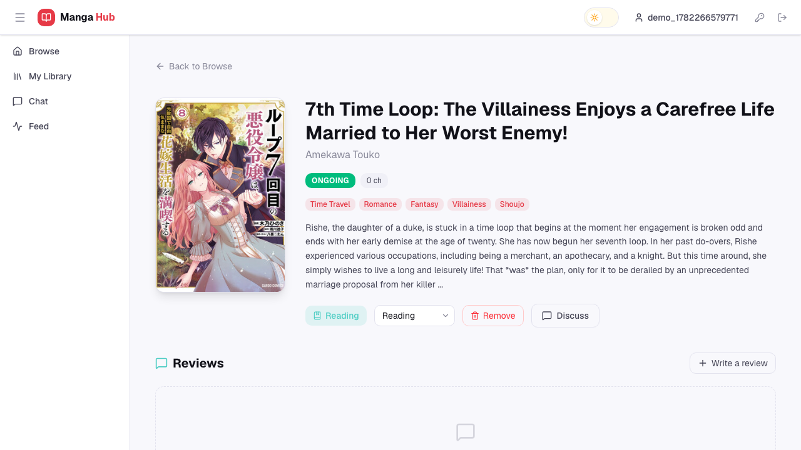
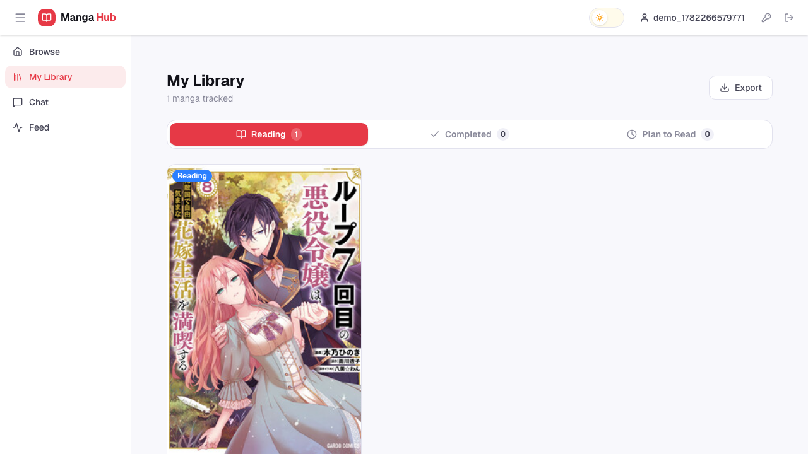
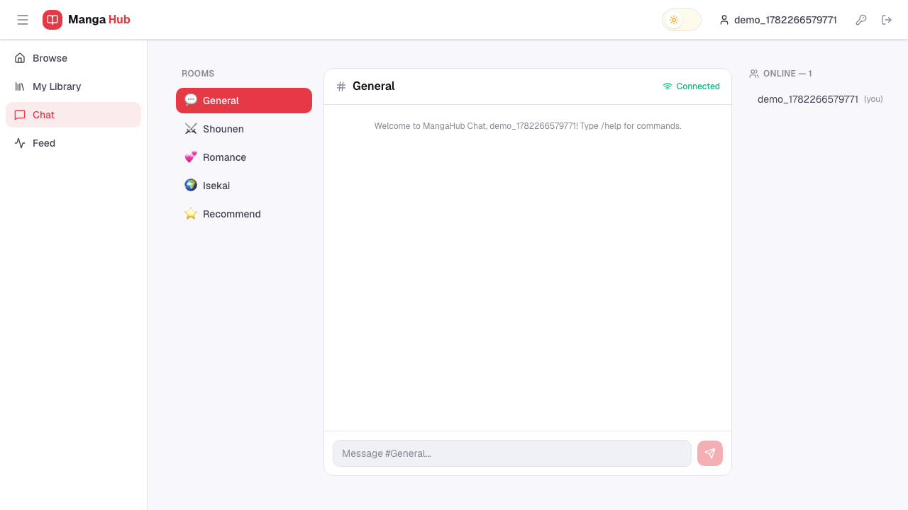

# MangaHub

MangaHub is a full-stack manga tracking and reading platform. The **Go backend**
exposes an HTTP REST API plus real-time TCP progress synchronization, UDP
notifications, gRPC, and WebSocket chat. The **React + Vite frontend** is a single
-page app for browsing manga, tracking a reading library, writing reviews,
chatting in real time, and managing friends and an activity feed. Everything runs
under Docker Compose, with structured logging, per-IP rate limiting, OpenAPI-
generated TypeScript types, and a Playwright end-to-end test suite in CI.

## Table of Contents
1. [Tech Stack](#tech-stack)
2. [Architecture Overview](#architecture-overview)
3. [Setup Instructions](#setup-instructions)
4. [Frontend (React SPA)](#frontend-react-spa)
5. [Testing](#testing)
6. [Screenshots](#screenshots)
7. [API Documentation](#api-documentation)
8. [CLI Commands](#cli-commands)

---

## Tech Stack

**Backend** — Go 1.25, [Gin](https://github.com/gin-gonic/gin),
`gorilla/websocket`, `mattn/go-sqlite3` (SQLite + WAL), `redis/go-redis`,
`golang-jwt`, `golang.org/x/time/rate` (rate limiting), `log/slog` (structured
logging), `swaggo/swag` (OpenAPI).

**Frontend** — React 19 + TypeScript, [Vite](https://vite.dev), Tailwind CSS v4,
shadcn/ui, TanStack Query (server state), Zustand (client state), React Router v7,
Framer Motion, Sonner (toasts), axios.

**Tooling** — Docker Compose, GitHub Actions CI (Go build/test/vet, frontend
build, Docker smoke test, Playwright E2E, GHCR publish), `openapi-typescript` +
`swagger2openapi` (generated API types), Playwright (E2E).

---

## Architecture Overview

MangaHub operates using a multi-protocol approach, featuring both a monolithic HTTP REST API and specialized standalone services for real-time operations. It is organized as a multi-service Go application with a shared SQLite data layer.

### Repository Structure

**Service Layout**
- `cmd/api-server` - HTTP API entrypoint
- `cmd/tcp-server` - TCP progress sync server
- `cmd/tcp-client` - TCP progress sync test client
- `cmd/udp-server` - UDP notification server
- `cmd/grpc-server` - gRPC service entrypoint
- `cmd/cli` - CLI entrypoint

**Internal Packages**
- `internal/activity` - feed and social activity tracking
- `internal/auth` - authentication service and middleware
- `internal/friend` - friend request and management logic
- `internal/manga` - manga business logic and caching
- `internal/user` - user, library, and progress logic and caching
- `internal/review` - review and rating logic and caching
- `internal/sharedlist` - shared reading list management
- `internal/tcp` - TCP synchronization server logic
- `internal/udp` - UDP notification server logic
- `internal/websocket` - WebSocket chat hub and handler
- `internal/grpc` - gRPC service implementation
- `pkg/cache` - Redis client wrapper
- `pkg/database` - SQLite store and repositories
- `pkg/models` - shared models
- `pkg/utils` - shared utilities + typed `AppError` / `RespondError`
- `pkg/logger` - structured slog setup + per-request logging middleware
- `pkg/ratelimit` - per-IP token-bucket rate limiter
- `proto` - protobuf definitions and generated code

**Frontend (`frontend/`)**
- `src/pages` - route pages (Browse, Manga detail, Library, Chat, Feed, Profile, Auth)
- `src/components` - UI + layout (Navbar, Sidebar, ErrorBoundary, FriendsPanel, …)
- `src/api` - axios client + per-domain API modules + generated `schema.d.ts`
- `src/hooks` - `useChat` (WebSocket), `useDebounce`
- `src/store` - Zustand stores (`authStore`, `uiStore`)
- `src/lib` - `notify` (Sonner toast helper)
- `e2e` - Playwright end-to-end tests

> **api-server layout:** after the refactor, `cmd/api-server/main.go` is ~110
> lines of wiring; route handlers are methods on `*APIServer` split across
> `routes.go`, `health.go`, `sync.go`, `notify.go`, `data.go`, `chat.go`, and
> `bootstrap.go`.

### HTTP REST API & Data Flow

The core HTTP API follows a standard layered architecture:
- **Handler Layer (`internal/*/handler.go`)**: Parses HTTP requests, calls the appropriate service, and formats JSON responses.
- **Service Layer (`internal/*/service.go`)**: Encapsulates business rules, handles validation, and manages caching logic.
- **Repository Layer (`internal/*/repository.go`)**: Interacts directly with the SQLite database executing raw SQL queries.

**Data Flow:**
```text
Client (React SPA / CLI)
   -> Gin router
   -> Recovery -> RequestLogger (slog) -> CORS -> RateLimit (100/300 per min)
   -> Auth Middleware (JWT, on protected groups)
   -> Handler -> Service -> Repository -> SQLite (WAL)
                    |                          ^
                    v                          |
              Redis Cache              (services return *AppError;
                                        handlers map via RespondError)
```

### Real-time Features & Protocols

1. **HTTP API**: Handles authentication, manga browsing, library updates, reviews, and health checks.
2. **TCP Progress Sync (`:9090`)**: A robust TCP server that handles real-time reading progress synchronization among users, featuring collision detection, automated resolutions, and persistent storage synchronization.
3. **UDP Notifications (`:9091`)**: A lightweight push notification system for broadcasting system events or chapter updates to active clients.
4. **WebSocket ChatHub (`:8080/ws/chat`)**: Multi-room chat support enabling real-time discussion across the entire platform or within specific manga rooms.
5. **gRPC Server(`:9092`)**: Exposes internal manga and progress methods for inter-service communication.

### Data Storage & Caching

- **SQLite**: The application stores persistent data with tables for users, manga, user progress, reviews, chat messages, and private messages. Seed manga data is loaded from `data/manga.sample.json` at startup.
- **Redis**: Used as an optional cache layer for frequently accessed read paths in manga, review, and user services.

---

## Setup Instructions

### 1. Prerequisites

* Docker and Docker Compose
* Go 1.25 or later

### 2. Environment Configuration

Copy the example environment file and configure it:

```powershell
copy .env.example .env
```

Ensure the following key variables are set in your `.env` file:
* `JWT_SECRET`: Change this to a secure random string for production.
* `REDIS_ADDR`: Points to `redis:6379` within the Docker network.
* Service feature flags (`ENABLE_TCP_SERVER`, etc.) are configured automatically via Docker Compose.

### 3. Start the Server (Docker Compose)

MangaHub uses Docker Compose to orchestrate the API server, real-time services (TCP, UDP, gRPC), and Redis cache.

Run the following command to start all services in the background:

```powershell
docker-compose build
docker-compose up
```

**Expected behavior:**
* Redis will start and serve as the caching layer.
* `mangahub-api` starts on port `8080` (HTTP & WebSocket).
* `mangahub-tcp` starts on port `9090` (TCP Progress Sync).
* `mangahub-udp` starts on port `9091` (UDP Notifications).
* `mangahub-grpc` starts on port `9092` (gRPC Internal Service).

### 4. Build Everything (if we use CLI instead of Docker)
#### Build CLI (must build for both approaches)
```powershell
go build -o mangahub.exe ./cmd/cli/
```
#### Build others (when using CLI instead of Docker or standalone server)
```powershell
cd C:\Users\Dell\Documents\Go\mangahub

# Build API server
go build ./cmd/api-server/

# Build TCP test client
go build ./cmd/tcp-client/

# Build standalone TCP server
go build ./cmd/tcp-server/

# Build standalone UDP server
go build ./cmd/udp-server/

# Build standalone gRPC server
go build ./cmd/grpc-server/
```
### 5. Fresh Database Initialization
If you need to start with a fresh SQLite database instance, simply remove the old database file inside the mounted volume directory:

```powershell
# Stop the containers first:
docker-compose down
# Remove the database file:
Remove-Item .\data\mangahub.db -Force -ErrorAction SilentlyContinue
# Restart the containers:
docker-compose up -d
```
---

## Frontend (React SPA)

The frontend is served by nginx on **http://localhost:3000** under Docker
Compose. For local development with hot reload:

```bash
cd frontend
npm install          # first time (uses .npmrc legacy-peer-deps)
npm run dev          # Vite dev server → http://localhost:5173
```

The browser app calls the backend at `VITE_API_URL` (default
`http://localhost:8080`). Other useful scripts:

```bash
npm run build        # type-check + bundle (runs gen:api as a prebuild step)
npm run gen:api      # regenerate src/api/schema.d.ts from the Swagger spec
npm run lint
```

**Generated API types:** request types are generated from the backend Swagger
spec via `swagger2openapi` (2.0 → 3.0) then `openapi-typescript`. The output
`src/api/schema.d.ts` is committed; `npm run build` refreshes it automatically.
When the API changes, run `cp docs/swagger.json frontend/openapi.json` then
`npm run gen:api`.

---

## Testing

```bash
# Backend unit tests
GOFLAGS=-tags=sqlite_fts5 go test ./...

# Frontend type-check + build
cd frontend && npm run build

# End-to-end (Playwright) — needs the backend running on :8080
cd frontend
npm run test:e2e        # headless (auto-starts the Vite dev server)
npm run test:e2e:ui     # interactive UI mode
```

The E2E suite (`frontend/e2e/journey.spec.ts`) walks one user through the full
journey: **register → login → add to library → update progress → review → chat**,
then cleans up its test data. CI runs Go tests, the frontend build, a Docker
smoke test, and the Playwright `e2e` job. See `docs/TESTING.md` for the full
manual API/CLI test guide.

---

## Screenshots

> Screenshots live in [`img/`](img/) and are generated with the Playwright helper
> `frontend/e2e/screenshots.spec.ts` (`npm run screenshots`). See
> [Generating screenshots](#generating-screenshots) below.

| Browse | Manga detail |
|---|---|
|  |  |

| Library | Chat |
|---|---|
|  |  |

### Generating screenshots

With the backend and frontend running, capture fresh screenshots into `img/`:

```bash
cd frontend
npm run screenshots      # drives the app with Playwright and writes img/*.png
```

---

## API Documentation

Below is a summary of the available HTTP REST API endpoints. For the details, please read the MangaHub_API.postman_collection.json

### Authentication

| Endpoint | Method | Description |
|---|---|---|
| `/auth/register` | `POST` | Register a new user |
| `/auth/login` | `POST` | Authenticate and retrieve JWT token |
| `/auth/status` | `GET` | Get current authentication status |
| `/auth/change-password` | `PUT` | Update the authenticated user's password |

### Manga Database

| Endpoint | Method | Description |
|---|---|---|
| `/manga` | `GET` | Search and retrieve all manga |
| `/manga/:id` | `GET` | Retrieve specific manga by ID |
| `/manga` | `POST` | Create a new manga entry |
| `/manga/:id` | `PUT` | Update existing manga details |
| `/manga/:id` | `DELETE` | Delete a manga from the database |

### User Library & Reading Progress

| Endpoint | Method | Description |
|---|---|---|
| `/users/library` | `GET` | Retrieve authenticated user's library |
| `/users/library` | `POST` | Add a manga to the user's library |
| `/users/progress` | `PUT` | Update reading progress for a specific manga |
| `/users/library/:id` | `DELETE` | Remove a manga from the library |

### Activity Feed & Social Timeline

| Endpoint | Method | Description |
|---|---|---|
| `/feed/activities` | `GET` | Get general activity feed |
| `/users/:user_id/activities` | `GET` | View a specific user's activity feed |
| `/feed/stats` | `GET` | View feed statistics |
| `/feed/activities` | `POST` | Post a new activity to the feed |
| `/feed/timeline` | `GET` | View chronological social timeline |

### Review & Rating

| Endpoint | Method | Description |
|---|---|---|
| `/manga/:id/reviews` | `GET` | Get all reviews for a specific manga |
| `/users/reviews` | `GET` | Retrieve reviews created by the authenticated user |
| `/manga/:id/reviews` | `POST` | Submit a new review for a manga |
| `/manga/:id/rating-stats`| `GET` | Get rating statistics for a manga |
| `/reviews/:review_id` | `PUT` | Update an existing review |
| `/reviews/:review_id` | `DELETE` | Delete a review |
| `/reviews/:review_id/helpful` | `POST` | Mark a specific review as helpful |

### Friend System

| Endpoint | Method | Description |
|---|---|---|
| `/friends/add` | `POST` | Send a friend request |
| `/friends/:id/decline` | `POST` | Decline a pending friend request |
| `/friends/:id/accept` | `POST` | Accept a pending friend request |
| `/users/friends` | `GET` | Retrieve all accepted friends |
| `/friends/:id` | `DELETE` | Remove a user from friends list |
| `/users/friends/pending` | `GET` | View pending incoming friend requests |

### Shared Reading Lists

| Endpoint | Method | Description |
|---|---|---|
| `/reading-lists/public` | `GET` | View public shared reading lists |
| `/reading-lists/:list_id` | `GET` | View detailed items in a specific reading list |
| `/reading-lists/create` | `POST` | Create a new shared reading list |
| `/reading-lists/:list_id/manga`| `POST` | Add manga to a reading list |
| `/reading-lists/:list_id/manga/:manga_id` | `DELETE` | Remove a manga from a reading list |
| `/reading-lists/:list_id/subscribe` | `POST` | Subscribe to another user's shared list |
| `/reading-lists/subscribed` | `GET` | View all subscribed lists |
| `/reading-lists/:list_id/subscribe` | `DELETE` | Unsubscribe from a list |

### Real-time Features (TCP/UDP/WS)

| Endpoint | Method | Description |
|---|---|---|
| `/sync/status` | `GET` | Check the status of the TCP Progress Sync server |
| `/sync/strategy` | `PUT` | Update conflict resolution strategy for TCP sync |
| `/ws/chat` | `GET` | WebSocket connection endpoint for real-time chat |
| `/chat/history` | `GET` | Retrieve previous chat history logs |
| `/notify/broadcast` | `POST` | Broadcast system or release notifications |

### System Health & Data Management

| Endpoint | Method | Description |
|---|---|---|
| `/health` | `GET` | View system health status |
| `/cache/stats` | `GET` | View internal cache usage statistics |
| `/cache/flush` | `DELETE` | Flush/Clear all Redis cache data |
| `/data/export-json` | `GET` | Export database entries to JSON |
| `/data/seed` | `POST` | Seed the database with sample data |
| `/data/fetch-mangadex` | `POST` | Fetch external data from MangaDex |

---

## CLI Commands
### Authentication
```powershell
.\mangahub.exe auth register --username alice
.\mangahub.exe auth login --username alice
.\mangahub.exe auth status
.\mangahub.exe auth logout
.\mangahub.exe auth change-password
```

### Manga Management
```powershell
.\mangahub.exe manga search "one piece"
.\mangahub.exe manga search naruto --limit 5
.\mangahub.exe manga search "" --genre Shounen
.\mangahub.exe manga info one-piece
.\mangahub.exe manga list
.\mangahub.exe manga list --status ongoing
```

### Library & Progress Tracking
```powershell
.\mangahub.exe library add --manga-id one-piece --status reading
.\mangahub.exe library list
.\mangahub.exe library list --status reading
.\mangahub.exe library remove --manga-id death-note
.\mangahub.exe library update --manga-id one-piece --status completed
.\mangahub.exe progress update --manga-id one-piece --chapter 1095
.\mangahub.exe progress history
```

### Review & Rating
```powershell
.\mangahub.exe review add --manga-id one-piece --rating 10 --text "Masterpiece!"
.\mangahub.exe review list --manga-id one-piece
.\mangahub.exe review mine
.\mangahub.exe review stats --manga-id one-piece
.\mangahub.exe review update --review-id <id> --rating 9 --text "Still great"
.\mangahub.exe review helpful --review-id <id>
.\mangahub.exe review delete --review-id <id>
```

### TCP Sync & Real-time Server
```powershell
.\mangahub.exe sync status
.\mangahub.exe sync strategy
.\mangahub.exe sync strategy merge
.\mangahub.exe sync connect
# Then type: ping
# Then type: status
# Then type: progress one-piece 1095
# The strategy default is last_write_wins
# Then type: progress one-piece 1000 (server keeps ch.1000)
# Then type: strategy merge
# Then type: progress one-piece 500 (server keeps ch.1000 - higher chapter)
# Then type: strategy user_choice
# Then type: progress one-piece 300 (server rejects ch.300 - conflict notification sent)
# Then type: quit
.\mangahub.exe sync conflicts
.\mangahub.exe sync monitor
.\mangahub.exe server status
```

### UDP Notifications
```powershell
.\mangahub.exe notify test
.\mangahub.exe notify subscribe
.\mangahub.exe notify send --type new_chapter --manga-id one-piece --message "Chapter 1121 released!"
.\mangahub.exe notify send --type system --message "Server maintenance at midnight"
```

### WebSocket Chat
```powershell
.\mangahub.exe chat join general
.\mangahub.exe chat join one-piece
.\mangahub.exe chat send general "Hello everyone!"
.\mangahub.exe chat history general
.\mangahub.exe chat history one-piece --limit 50
```

### gRPC Internal Commands
```powershell
.\mangahub.exe grpc manga get --id one-piece
.\mangahub.exe grpc manga search --query naruto
.\mangahub.exe grpc progress update --user-id user-alice --manga-id one-piece --chapter 500
```
### User Reviews & Ratings
```powershell
# 1. Create a review for a manga
.\mangahub.exe review add --manga-id one-piece --rating 9 --text "Amazing adventure, highly recommended!"

# 2. Get all reviews for a manga
.\mangahub.exe review list --manga-id one-piece

# 3. Get your own reviews
.\mangahub.exe review mine

# 4. Get rating statistics for a manga
.\mangahub.exe review stats --manga-id one-piece

# 5. Update an existing review
.\mangahub.exe review update --review-id <id> --rating 10 --text "Masterpiece!"

# 6. Mark a review as helpful
.\mangahub.exe review helpful --review-id <id>

# 7. Delete a review
.\mangahub.exe review delete --review-id <id>
```
### Friend System
```powershell
# Terminal 1 (Alice): Send friend request
.\mangahub.exe friend add --id user-bob

# Terminal 2 (Bob): View pending and accept
.\mangahub.exe friend pending
.\mangahub.exe friend accept --id user-alice

# Terminal 1 (Alice): View friends list
.\mangahub.exe friend list

# Terminal 1 (Alice): Remove friend
.\mangahub.exe friend remove --id user-bob
```
### Reading Lists Sharing
```powershell
# 1. Create a shared list
.\mangahub.exe sharedlist create --name "Top Shounen" --manga-ids "one-piece,naruto" --public

# 2. View own lists
.\mangahub.exe sharedlist mine

# 3. View public lists
.\mangahub.exe sharedlist public

# 4. View detailed list items
.\mangahub.exe sharedlist view --id <list_id>

# 5. Add manga to own list
.\mangahub.exe sharedlist add-manga --id <list_id> --manga-id <manga_id>

# 6. Remove manga from own list
.\mangahub.exe sharedlist remove-manga --id <list_id> --manga-id <manga_id>

# 7. Subscribe to a shared list
.\mangahub.exe sharedlist subscribe --id <list_id>

# 8. View subscribed lists
.\mangahub.exe sharedlist subscribed

# 9. Unsubscribe from a list
.\mangahub.exe sharedlist unsubscribe --id <list_id>
```
### Activity Feed
```powershell
# Bob views his friends' activities (will see Alice's)
.\mangahub.exe feed view

# Alice views her own activities
.\mangahub.exe feed mine

# Alice creates a custom activity post
.\mangahub.exe feed post "Just started watching the new anime adaptation!"

# View feed statistics
.\mangahub.exe feed stats

# View social timeline
.\mangahub.exe feed timeline
```
### Export Library to JSON (CLI)

```powershell
# Export your library as JSON
.\mangahub.exe export library --format json --output library.json
```

### Export Library to CSV (CLI)

```powershell
# Export library as CSV
.\mangahub.exe export library --format csv --output library.csv
```

### Export Reading Progress to CSV (CLI)

```powershell
# Export progress as CSV (default format)
.\mangahub.exe export progress --format csv --output progress.csv

# Or as JSON
.\mangahub.exe export progress --format json --output progress.json
```
### Full Data Export as tar.gz Archive (CLI)
```powershell
# Create a full backup archive
.\mangahub.exe export all --output mangahub-backup.tar.gz
```
### Import Library from JSON (CLI)
```powershell
# Import library entries from a previously exported JSON file
.\mangahub.exe import library --file library.json
```
### Import Progress from CSV (CLI)
```powershell
# Import progress from a CSV file
.\mangahub.exe import progress --file progress.csv
```
### Import Manga from JSON (CLI)
```powershell
# Import manga data from a JSON file
.\mangahub.exe import manga --file manga.json
```
