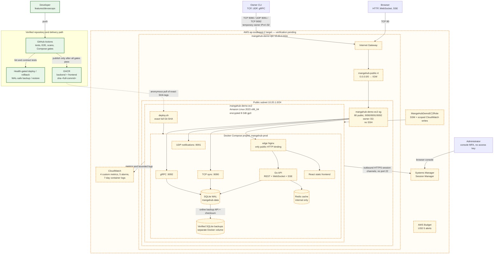

# MangaHub AWS DevSecOps architecture

Status: **repository, CI, images, and local production runtime verified; AWS
resources and EC2 execution pending manual evidence**.

This document separates what currently exists from the Sydney target
environment. A dashed AWS boundary means “designed and implemented in the
repository, but not yet observed in the account.” Update that boundary only
after the matching record in `docs/AWS_EVIDENCE.md` passes.

## End-to-end delivery and runtime

The diagram shows target placement, not a claim that the AWS nodes exist. The
same Compose topology inside the dashed boundary has passed locally; running it
on the named EC2 instance remains a separate gate.

## Request and protocol paths

| Client path | Public host listener | Edge/application destination | Exposure rule |
|---|---:|---|---|
| Frontend | TCP 80 | edge → frontend Nginx | Public demo |
| REST API | TCP 80, `/api/*` | edge strips `/api` → Go API | Public demo |
| WebSocket | TCP 80, `/api/ws/*` | edge preserves upgrade → Go API | JWT-authenticated application path |
| SSE | TCP 80, `/api/events/*` | edge disables buffering → Go API | JWT validated by the SSE handler |
| TCP sync | TCP 9090 | standalone TCP container | Owner IPv4 `/32`, only while demonstrating |
| UDP notifications | UDP 9091 | standalone UDP container | Owner IPv4 `/32`, only while demonstrating |
| gRPC | TCP 9092 | standalone gRPC container | Owner IPv4 `/32`, only while demonstrating |
| Administration | No inbound listener | Systems Manager Session Manager | IAM/MFA and instance role; no port 22 |

HTTPS does not replace or disable the raw listeners. A later domain can add TLS
for browser traffic and, independently, TLS for TCP/gRPC. The current HTTP and
raw-protocol demo is intentionally temporary and uses disposable data.

## Security boundaries

1. The project VPC and Security Group are separate from the account defaults.
2. Only the edge container binds a public web port in base mode. Redis, the API,
   frontend, and databases remain on Docker networks.
3. Raw bindings require both the `--with-raw` Compose override and three
   owner-only Security Group rules. Removing either closes external access.
4. The EC2 role supplies temporary credentials. No AWS access key or registry
   token is stored on the instance.
5. The protected runtime environment is root-owned mode `0600`; deployment
   scripts never print it.
6. Images use full-SHA tags and are pulled before the running release changes.
7. A failed health gate does not advance the recorded healthy release.
8. Deploy, rollback, backup, and restore never delete Docker volumes.
9. CloudWatch permissions are restricted to `MangaHub/EC2` and seven named log
   streams; the role cannot create the log group or change retention.

## Verification boundary

| Area | Current evidence | State |
|---|---|---|
| CI and security gates | GitHub Actions branch history; pinned workflow actions and scanners | Verified |
| Immutable images | Public matching backend/frontend full-SHA GHCR manifests | Verified |
| Production Compose and edge routing | Local HTTP, WebSocket, SSE, TCP, UDP, gRPC, hardening, persistence, and restart rehearsals | Verified locally |
| Release rollback | Two-version local rehearsal with the same SQLite volume/inode | Verified locally |
| SQLite recovery | Isolated online backup, checksum/integrity validation, atomic restore, and failure guard | Verified locally |
| Monitoring implementation | IAM policy, agent config, log override, systemd units, publisher tests | Verified locally |
| Account, budget, IAM MFA | Requires Checkpoint A evidence | Pending AWS |
| VPC, subnet, routes, Security Group | Requires Checkpoints C–D evidence | Pending AWS |
| EC2, SSM, Docker | Requires Checkpoints E–G evidence | Pending AWS |
| Public application and raw protocols | Requires Checkpoint I evidence | Pending AWS |
| EC2 rollback and recovery | Requires controlled EC2 rehearsals | Pending AWS |
| CloudWatch metrics, logs, SNS, alarm transition | Requires Checkpoint K evidence | Pending AWS |

## Known limitations and intentional exclusions

- One instance and one SQLite database are a single failure domain; this is not
  a highly available architecture.
- HTTP and raw protocols are not encrypted in the domain-free demo.
- The auto-assigned public IPv4 may change after stop/start.
- Backups are on a separate Docker volume but the same EBS device; off-instance
  encrypted backup is not implemented.
- GitHub Actions publishes images but does not deploy to EC2 yet. Manual
  deployment must pass before controlled CD is considered.
- No NAT Gateway, load balancer, RDS, Elastic IP, domain, or certificate is part
  of the first lab.

Operational details live in `docs/AWS_DEPLOYMENT.md`, `docs/SECURITY.md`,
`docs/ROLLBACK.md`, `docs/BACKUP.md`, and `docs/MONITORING.md`.
