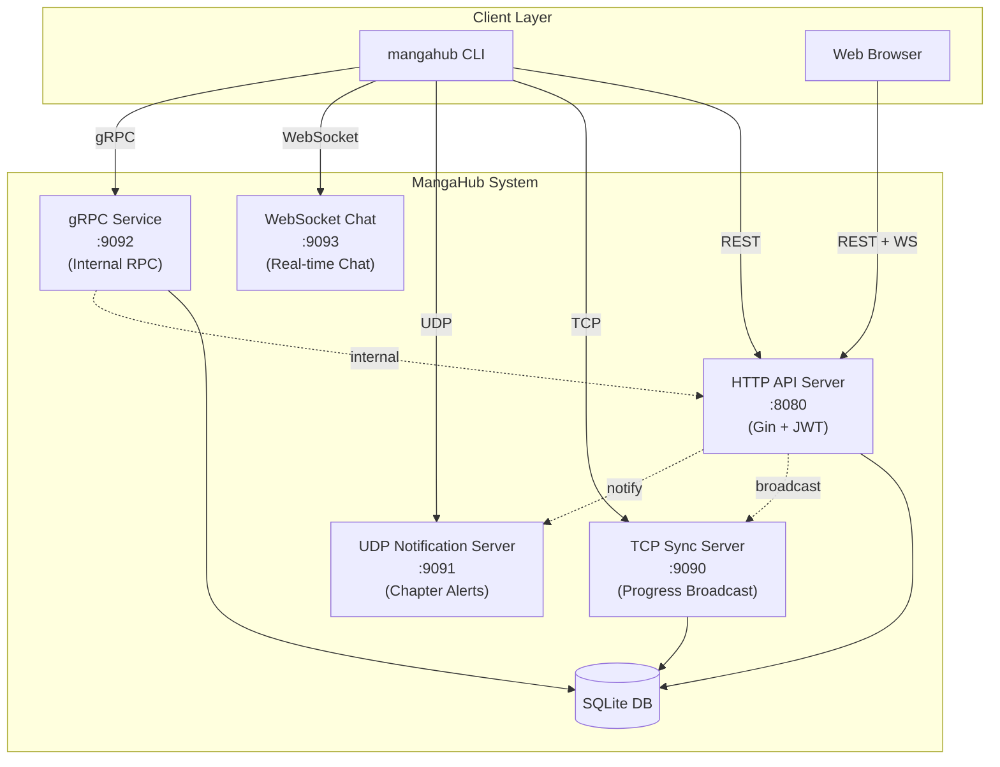
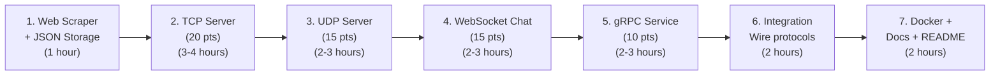

# MangaHub — Complete Project Plan

> Informed by all 3 reference documents:
> - `mangahub_project_spec.pdf` — Requirements, grading, protocol specs
> - `mangahub_cli_manual (reference).pdf` — CLI commands, ports, config
> - `mangahub_usecase (reference).pdf` — Actors, use cases, metrics

---

## Grading Breakdown (100 points total, 30% of course grade)

| Category | Points | Status |
|----------|--------|--------|
| HTTP REST API Server | 25 | ✅ **Done** |
| TCP Progress Sync Server | 20 | ❌ Not started |
| UDP Notification System | 15 | ❌ Not started |
| WebSocket Chat System | 15 | ❌ Not started |
| gRPC Internal Service | 10 | ❌ Not started |
| Database Layer | 10 | ✅ **Done** |
| **Subtotal (Core)** | **95** | **35 done** |
| Bonus (Advanced features) | Up to 20 | ❌ Not started |

> [!IMPORTANT]
> The grading also evaluates **Integration (20pts)**, **Quality/Testing (10pts)**, and **Docs/Demo (10pts)** as part of the 100-point total. These are embedded within the component scores.

---

## Port Assignments (from CLI Manual)

| Service | Protocol | Port | Status |
|---------|----------|------|--------|
| HTTP API Server | HTTP | `:8080` | ✅ Running |
| TCP Sync Server | TCP | `:9090` | ❌ TODO |
| UDP Notification Server | UDP | `:9091` | ❌ TODO |
| gRPC Internal Service | gRPC | `:9092` | ❌ TODO |
| WebSocket Chat Server | WebSocket | `:9093` | ❌ TODO |

> [!NOTE]
> CLI manual specifies WebSocket on its own port `:9093`, not embedded in the HTTP server.
> We need to decide: run WS on the Gin HTTP server (`:8080/ws/chat`) or separate (`:9093`).
> **Recommendation:** Use `:8080/ws/chat` route on Gin for simplicity, but also expose `:9093` as the CLI expects.

---

## Architecture Overview



---

## ✅ COMPLETED TASKS

### Phase 1: Foundation — COMPLETE

| File | Component | Status |
|------|-----------|--------|
| [main.go](file:///c:/Users/Dell/Documents/Go/mangahub/cmd/api-server/main.go) | HTTP server, routes, .env loading, APIServer struct | ✅ |
| [sqlite.go](file:///c:/Users/Dell/Documents/Go/mangahub/pkg/database/sqlite.go) | SQLite init, schema (users/manga/user_progress) | ✅ |
| [models.go](file:///c:/Users/Dell/Documents/Go/mangahub/pkg/models/models.go) | All data structures (string IDs, JSON genres) | ✅ |
| [jwt.go](file:///c:/Users/Dell/Documents/Go/mangahub/internal/auth/jwt.go) | JWT generate/validate/middleware | ✅ |
| [internal/manga/*](file:///c:/Users/Dell/Documents/Go/mangahub/internal/manga/) | Repository, Service, Handler, MangaDex client | ✅ |
| [internal/user/*](file:///c:/Users/Dell/Documents/Go/mangahub/internal/user/) | Repository, Service, Handler | ✅ |
| [seed.go](file:///c:/Users/Dell/Documents/Go/mangahub/data/seed.go) | 100 manga (25 per genre) | ✅ |
| [mangadex.go](file:///c:/Users/Dell/Documents/Go/mangahub/internal/manga/mangadex.go) | MangaDex API: 100 additional series | ✅ |
| [.env](file:///c:/Users/Dell/Documents/Go/mangahub/.env) | Configuration file | ✅ |
| [response.go](file:///c:/Users/Dell/Documents/Go/mangahub/pkg/utils/response.go) | API response helpers | ✅ |

**Endpoints verified working:**
- `POST /auth/register` ✅ — `POST /auth/login` ✅
- `GET /manga` ✅ — `GET /manga/:id` ✅
- `POST /users/library` ✅ — `GET /users/library` ✅ — `PUT /users/progress` ✅
- `DELETE /users/library/:manga_id` ✅
- `POST /data/seed` ✅ — `POST /data/fetch-mangadex` ✅ — `GET /data/export-json` ✅

---

## 🔲 REMAINING TASKS — Ordered by Priority

### Task 1: Web Scraping Practice & JSON Storage (Phase 1 Cleanup)
**Priority:** Medium | **Points:** Part of data collection requirement

| File to Create | Purpose |
|----------------|---------|
| `data/scraper.go` | Scrape quotes from `quotes.toscrape.com`, test `httpbin.org` |
| `data/json_storage.go` | Export manga/user data to JSON files |
| `data/manga.json` | Exported manga database |
| `data/users/` | Per-user JSON files |

**Implementation:**
```go
// data/scraper.go
type Scraper struct { Client *http.Client }
func (s *Scraper) ScrapeQuotes(pages int) ([]models.ScrapedQuote, error)
func (s *Scraper) TestHTTPBin() (map[string]interface{}, error)

// data/json_storage.go
func ExportMangaToJSON(manga []models.Manga, path string) error
func ExportUserDataToJSON(data models.UserData, path string) error
func ImportMangaFromJSON(path string) ([]models.Manga, error)
```

**Add endpoints to API server:**
- `POST /data/scrape-quotes` — Run scraper
- `GET /data/scraped-quotes` — View scraped data

---

### Task 2: TCP Progress Sync Server (20 points)
**Priority:** 🔴 Highest | **Port:** `:9090`

**Files to create:**

| File | Purpose |
|------|---------|
| `internal/tcp/server.go` | TCP listener, connection manager |
| `internal/tcp/handler.go` | Per-connection goroutine handler |
| `internal/tcp/protocol.go` | JSON message framing (newline-delimited) |
| `cmd/tcp-server/main.go` | Entry point |

**Spec-required struct:**
```go
type ProgressSyncServer struct {
    Port        string
    Connections map[string]net.Conn  // user_id -> connection
    Broadcast   chan ProgressUpdate
    mu          sync.RWMutex
}

type ProgressUpdate struct {
    UserID    string `json:"user_id"`
    MangaID   string `json:"manga_id"`
    Chapter   int    `json:"chapter"`
    Timestamp int64  `json:"timestamp"`
}
```

**Message protocol (JSON over TCP, newline-delimited):**
```
Client → Server: {"type":"connect","user_id":"user123"}\n
Client → Server: {"type":"progress","user_id":"user123","manga_id":"one-piece","chapter":1095}\n
Server → Client: {"type":"broadcast","user_id":"user456","manga_id":"naruto","chapter":700}\n
Server → Client: {"type":"welcome","message":"Connected to TCP sync"}\n
```

**CLI commands this supports (from CLI manual):**
- `mangahub sync connect` — Connect to TCP server
- `mangahub sync disconnect` — Disconnect
- `mangahub sync status` — Check connection
- `mangahub sync monitor` — Watch live progress updates

**Requirements checklist:**
- [ ] Accept multiple TCP connections
- [ ] Broadcast progress updates to ALL connected clients
- [ ] Handle client connect/disconnect gracefully
- [ ] JSON message protocol
- [ ] Concurrent handling with goroutines
- [ ] Integration: HTTP `PUT /users/progress` triggers TCP broadcast

---

### Task 3: UDP Notification System (15 points)
**Priority:** 🔴 High | **Port:** `:9091`

**Files to create:**

| File | Purpose |
|------|---------|
| `internal/udp/server.go` | UDP listener, client registry |
| `internal/udp/notifier.go` | Broadcast notifications |
| `cmd/udp-server/main.go` | Entry point |

**Spec-required struct:**
```go
type NotificationServer struct {
    Port    string
    Clients []net.UDPAddr
    mu      sync.RWMutex
}

type Notification struct {
    Type      string `json:"type"`      // "new_chapter", "system", "manga_update"
    MangaID   string `json:"manga_id"`
    Message   string `json:"message"`
    Timestamp int64  `json:"timestamp"`
}
```

**Message flow:**
```
Client → Server: {"type":"register"}\n          → Server adds client addr
Client → Server: {"type":"unregister"}\n        → Server removes client addr
Server → Client: {"type":"new_chapter","manga_id":"one-piece","message":"Chapter 1121 released!"}\n
```

**CLI commands this supports:**
- `mangahub notify subscribe` — Register for notifications
- `mangahub notify unsubscribe` — Unregister
- `mangahub notify test` — Test UDP system

**Requirements checklist:**
- [ ] UDP server listening for registrations
- [ ] Broadcast chapter release notifications to all registered clients
- [ ] Client list management (add/remove addresses)
- [ ] Basic error logging
- [ ] Fire-and-forget delivery (no ACK needed)

---

### Task 4: WebSocket Chat System (15 points)
**Priority:** 🔴 High | **Port:** `:9093` (or `:8080/ws/chat`)

**Files to create:**

| File | Purpose |
|------|---------|
| `internal/websocket/hub.go` | ChatHub with register/unregister/broadcast channels |
| `internal/websocket/client.go` | Per-client readPump/writePump goroutines |
| Add WS route to API server | `GET /ws/chat` upgrade handler |

**Spec-required struct:**
```go
type ChatHub struct {
    Clients    map[*websocket.Conn]string  // conn -> username
    Broadcast  chan ChatMessage
    Register   chan ClientConnection
    Unregister chan *websocket.Conn
}

type ChatMessage struct {
    UserID    string `json:"user_id"`
    Username  string `json:"username"`
    Message   string `json:"message"`
    Timestamp int64  `json:"timestamp"`
}

type ClientConnection struct {
    Conn     *websocket.Conn
    Username string
}
```

**CLI commands this supports:**
- `mangahub chat join <room>` — Join a chat room (e.g., `general`, `one-piece`)
- `mangahub chat send <room> <msg>` — Send message to a room
- `mangahub chat history <room>` — View history for a room
- Interactive: `/help`, `/users`, `/quit`, `/pm <user> <msg>`

**Requirements checklist:**
- [ ] WebSocket upgrade handling (gorilla/websocket)
- [ ] Real-time message broadcasting to all connected clients
- [ ] User join/leave notifications
- [ ] Connection lifecycle management
- [ ] Hub.Run() as central goroutine

---

### Task 5: gRPC Internal Service (10 points)
**Priority:** 🟡 Medium | **Port:** `:9092`

**Files to create:**

| File | Purpose |
|------|---------|
| `proto/manga.proto` | Protobuf message & service definitions |
| `internal/grpc/pb/` | Generated Go code (protoc output) |
| `internal/grpc/server.go` | MangaService implementation |
| `internal/grpc/client.go` | Client helper for HTTP→gRPC calls |
| `cmd/grpc-server/main.go` | Entry point |

**Proto definition (from spec):**
```protobuf
syntax = "proto3";
package mangahub;
option go_package = "mangahub/internal/grpc/pb";

service MangaService {
    rpc GetManga(GetMangaRequest) returns (MangaResponse);
    rpc SearchManga(SearchRequest) returns (SearchResponse);
    rpc UpdateProgress(ProgressRequest) returns (ProgressResponse);
}

message GetMangaRequest { string manga_id = 1; }
message MangaResponse {
    string id = 1; string title = 2; string author = 3;
    repeated string genres = 4; string status = 5;
    int32 total_chapters = 6; string description = 7;
}
message SearchRequest { string query = 1; string genre = 2; int32 limit = 3; }
message SearchResponse { repeated MangaResponse results = 1; int32 total = 2; }
message ProgressRequest { string user_id = 1; string manga_id = 2; int32 chapter = 3; }
message ProgressResponse { bool success = 1; string message = 2; }
```

**CLI commands this supports:**
- `mangahub grpc manga get --id <id>`
- `mangahub grpc manga search --query <term>`
- `mangahub grpc progress update --manga-id <id> --chapter <n>`

**Requirements checklist:**
- [ ] Protocol Buffer definitions (3 services)
- [ ] Basic gRPC server implementation
- [ ] Client integration
- [ ] Unary RPC calls
- [ ] Install: `protoc`, `protoc-gen-go`, `protoc-gen-go-grpc`

---

### Task 6: Integration — Connect All Protocols

**Cross-protocol triggers:**

| User Action | HTTP Endpoint | Triggers |
|-------------|---------------|----------|
| Update progress | `PUT /users/progress` | → TCP broadcast to all connected sync clients |
| Manga created/updated | `POST/PUT /manga` | → UDP notification to all subscribers |
| Chat message | WebSocket message | → Hub broadcasts to all WS clients |
| Internal manga query | HTTP handler | → gRPC `GetManga` call (optional delegation) |

**Integration points to add in `cmd/api-server/main.go`:**
```go
// In main(), create TCP/UDP clients that the HTTP handlers can use:
tcpBroadcaster := tcp.NewBroadcaster("localhost:9090")
udpNotifier := udp.NewNotifier("localhost:9091")

// Pass to handlers so they can trigger cross-protocol events
```

---

### Task 7: Docker Compose
**File:** `docker-compose.yml`

```yaml
version: '3.8'
services:
  api-server:
    build: { context: ., dockerfile: Dockerfile }
    ports: ["8080:8080"]
    volumes: ["./data:/app/data"]
    environment:
      - PORT=8080
      - DB_PATH=/app/data/mangahub.db
    command: ["/app/api-server"]

  tcp-server:
    build: { context: ., dockerfile: Dockerfile }
    ports: ["9090:9090"]
    command: ["/app/tcp-server"]

  udp-server:
    build: { context: ., dockerfile: Dockerfile }
    ports: ["9091:9091/udp"]
    command: ["/app/udp-server"]

  grpc-server:
    build: { context: ., dockerfile: Dockerfile }
    ports: ["9092:9092"]
    command: ["/app/grpc-server"]
```

---

### Task 8: Documentation & README

| File | Content |
|------|---------|
| `README.md` | Setup, build, run instructions |
| `docs/api.md` | All HTTP endpoints with curl examples |
| `docs/protocols.md` | TCP/UDP/WS/gRPC usage guide |
| `docs/architecture.md` | System diagram, data flow |

---

## Recommended Build Order



> [!TIP]
> **Start with TCP** — it's worth the most remaining points (20) and the pattern (listener → goroutine per connection → broadcast channel) directly applies to WebSocket chat. UDP is simpler. gRPC is independent.

---

## Performance Targets (from Use Case doc)

| Metric | Target | How to Verify |
|--------|--------|---------------|
| Registration success | 100% | Test register → login flow |
| Manga search latency | < 500ms | Benchmark `GET /manga?search=X` |
| Progress sync latency | < 1 second | Time TCP broadcast delivery |
| System uptime | 90% | Run for demo period |
| Concurrent users | 50-100 | Load test with multiple connections |
| TCP connections | 20-30 simultaneous | Connect multiple TCP clients |
| WebSocket users | 10-20 simultaneous | Multiple browser tabs |
| Manga database | 30-40+ series | ✅ We have 200 (100 seed + 100 MangaDex) |

---

## File Status Matrix — Complete

| File | Status | Points |
|------|--------|--------|
| `cmd/api-server/main.go` | ✅ Done | 25 |
| `cmd/tcp-server/main.go` | ❌ Empty | 20 |
| `cmd/udp-server/main.go` | ❌ Empty | 15 |
| `cmd/grpc-server/main.go` | ❌ Empty | 10 |
| `internal/auth/jwt.go` | ✅ Done | — |
| `internal/manga/*` (4 files) | ✅ Done | — |
| `internal/user/*` (3 files) | ✅ Done | — |
| `internal/tcp/server.go` | ❌ TODO | 20 |
| `internal/tcp/handler.go` | ❌ TODO | — |
| `internal/tcp/protocol.go` | ❌ TODO | — |
| `internal/udp/server.go` | ❌ TODO | 15 |
| `internal/udp/notifier.go` | ❌ TODO | — |
| `internal/websocket/hub.go` | ❌ TODO | 15 |
| `internal/websocket/client.go` | ❌ TODO | — |
| `internal/grpc/server.go` | ❌ TODO | 10 |
| `internal/grpc/client.go` | ❌ TODO | — |
| `internal/grpc/pb/` | ❌ TODO | — |
| `proto/manga.proto` | ❌ TODO | — |
| `pkg/models/models.go` | ✅ Done | 10 |
| `pkg/database/sqlite.go` | ✅ Done | — |
| `pkg/utils/response.go` | ✅ Done | — |
| `data/seed.go` | ✅ Done (100) | — |
| `data/scraper.go` | ❌ TODO | — |
| `data/json_storage.go` | ❌ TODO | — |
| `.env` | ✅ Done | — |
| `docker-compose.yml` | ❌ Placeholder | — |
| `Dockerfile` | ❌ TODO | — |
| `README.md` | ❌ Missing | — |

---

## What to Build Next?

Tell me which task you'd like to start and I'll implement it:

1. **Web Scraping + JSON Storage** — Quick win, completes Phase 1
2. **TCP Progress Sync Server** — Highest points (20), establishes pattern
3. **UDP Notification System** — Simpler, 15 points
4. **WebSocket Chat** — Fun, 15 points
5. **gRPC Service** — Independent, 10 points
6. **All remaining tasks** — I'll build them in order
