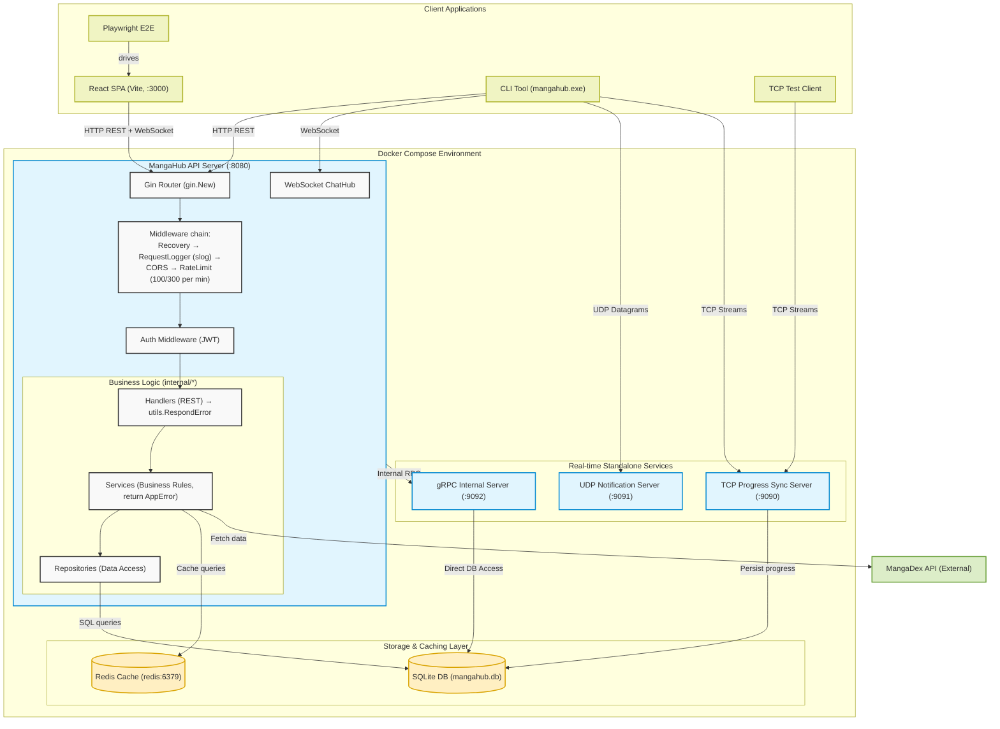

# MangaHub System Architecture

This diagram illustrates the end-to-end architecture of the MangaHub platform, highlighting the various protocols and data flows across the system.

## Cross-cutting concerns (backend refactor)

- **`main.go` is wiring only (~110 lines).** Inline route handlers were extracted
  into methods on `*APIServer`, grouped by concern in `cmd/api-server/`:
  `routes.go` (path → method map), `health.go`, `sync.go`, `notify.go`,
  `data.go`, `chat.go`, and `bootstrap.go` (server startup helpers).
- **Middleware order** (applied in `main`/`routes.go`): `gin.Recovery()` →
  `logger.RequestLogger()` → `cors` → `ratelimit.Middleware()`. The app uses
  `gin.New()` (not `gin.Default()`), replacing Gin's text logger with structured
  logging.
- **Structured logging** (`pkg/logger`): `log/slog`, one line per request with
  `request_id`, `user_id`, `latency_ms`, status (level by status: 2xx INFO / 4xx
  WARN / 5xx ERROR). `X-Request-ID` is returned on every response. The std `log`
  package is bridged into slog. `LOG_LEVEL` (debug|info|warn|error) and
  `LOG_FORMAT` (text for dev, json for prod — set in docker-compose) configure it.
- **Typed errors** (`pkg/utils/errors.go`): services return `*AppError` carrying
  an HTTP status; handlers call `utils.RespondError(c, err)` for consistent
  status codes (no more `err.Error() == "..."` string matching).
- **Rate limiting** (`pkg/ratelimit`): per-IP token bucket — 100 req/min for
  public requests, 300 req/min for authenticated ones; `/health*` and `/swagger*`
  are exempt; over-limit returns `429`.
- **SQLite** is opened with `WAL` + a busy timeout + foreign keys on; the
  first-run MangaDex seed runs in a background goroutine so the API listens
  immediately.

## Frontend & testing

- **React 19 + Vite SPA** (`frontend/`, served by nginx on :3000). TanStack Query
  for server state, Zustand for client state, Tailwind v4, Framer Motion, Sonner
  toasts, per-page React error boundaries.
- **Generated API types**: `npm run gen:api` converts the swaggo Swagger 2.0 spec
  to OpenAPI 3 (`swagger2openapi`) then to `src/api/schema.d.ts`
  (`openapi-typescript`), run as a `prebuild` step.
- **E2E**: Playwright drives the full journey (register → login → add to library →
  update progress → review → chat → cleanup) and runs as the `e2e` job in CI.
