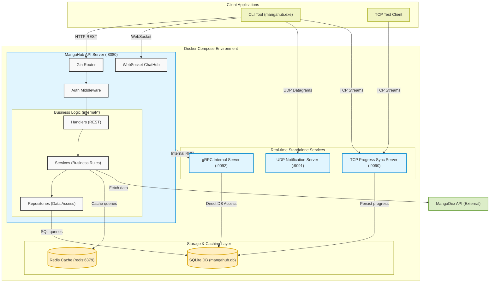

# MangaHub System Architecture

This diagram illustrates the end-to-end architecture of the MangaHub platform, highlighting the various protocols and data flows across the system.

```mermaid
graph TD
    %% Clients
    subgraph Clients ["Client Applications"]
        CLI["CLI Tool (mangahub.exe)"]
        TCPClient["TCP Test Client"]
    end

    %% External Services
    MangaDex["MangaDex API (External)"]

    %% Core Application Cluster
    subgraph DockerCompose ["Docker Compose Environment"]
        
        %% API Server
        subgraph APIServer ["MangaHub API Server (:8080)"]
            Router["Gin Router"]
            Auth["Auth Middleware"]
            WS["WebSocket ChatHub"]
            
            subgraph InternalLogic ["Business Logic (internal/*)"]
                Handlers["Handlers (REST)"]
                Services["Services (Business Rules)"]
                Repos["Repositories (Data Access)"]
            end
        end
        
        %% Real-time Services
        subgraph RealtimeServices ["Real-time Standalone Services"]
            TCPServer["TCP Progress Sync Server (:9090)"]
            UDPServer["UDP Notification Server (:9091)"]
            GRPCServer["gRPC Internal Server (:9092)"]
        end

        %% Data Layer
        subgraph DataLayer ["Storage & Caching Layer"]
            Redis[("Redis Cache (redis:6379)")]
            SQLite[("SQLite DB (mangahub.db)")]
        end
    end

    %% Client Interactions
    CLI -- "HTTP REST" --> Router
    CLI -- "WebSocket" --> WS
    CLI -- "UDP Datagrams" --> UDPServer
    CLI -- "TCP Streams" --> TCPServer
    TCPClient -- "TCP Streams" --> TCPServer

    %% HTTP API Flow
    Router --> Auth
    Auth --> Handlers
    Handlers --> Services
    Services --> Repos
    Services -- "Cache queries" --> Redis
    Repos -- "SQL queries" --> SQLite
    Services -- "Fetch data" --> MangaDex

    %% Inter-service / Backend connections
    TCPServer -- "Persist progress" --> SQLite
    GRPCServer -- "Direct DB Access" --> SQLite
    APIServer -- "Internal RPC" --> GRPCServer

    classDef default fill:#f9f9f9,stroke:#333,stroke-width:2px;
    classDef database fill:#ffefc2,stroke:#d9a300,stroke-width:2px;
    classDef server fill:#e1f5fe,stroke:#0288d1,stroke-width:2px;
    classDef client fill:#f0f4c3,stroke:#afb42b,stroke-width:2px;
    classDef external fill:#dcedc8,stroke:#689f38,stroke-width:2px;

    class CLI,TCPClient client;
    class SQLite,Redis database;
    class APIServer,TCPServer,UDPServer,GRPCServer server;
    class MangaDex external;
```
